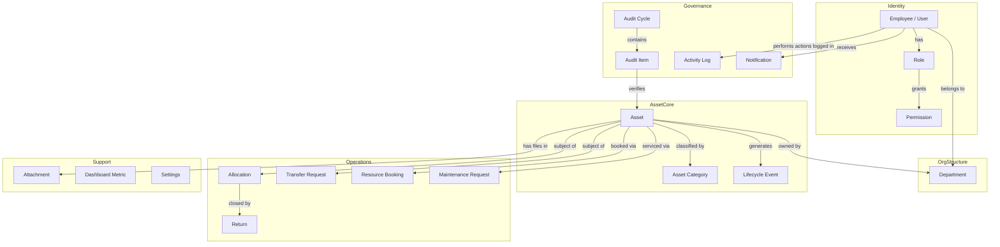
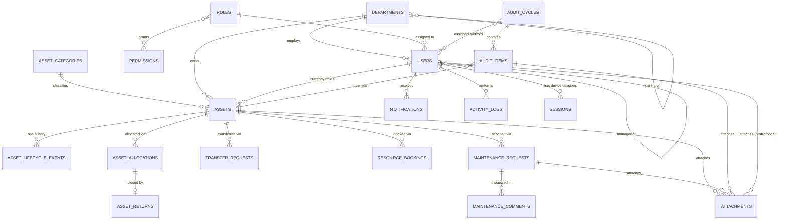
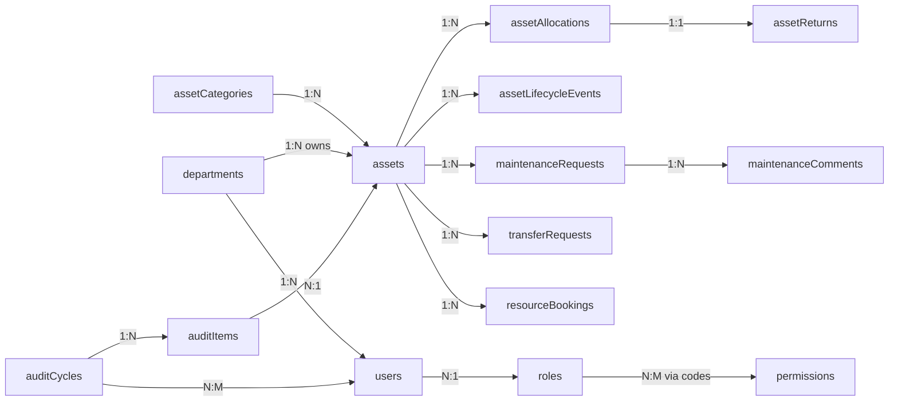
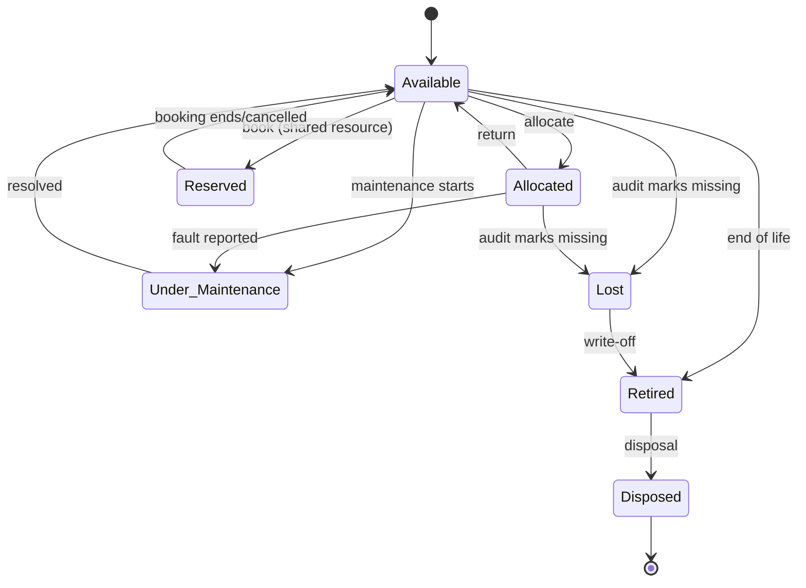
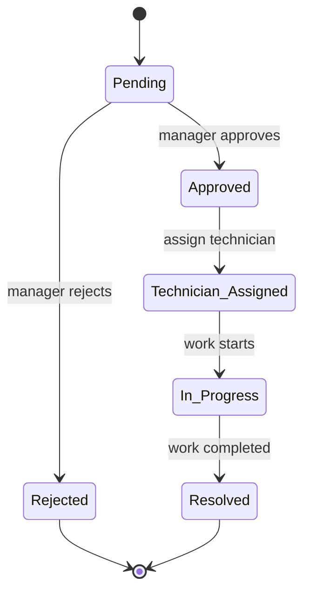
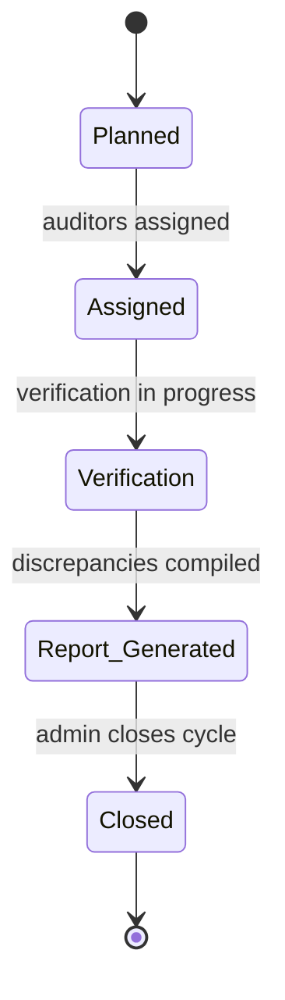
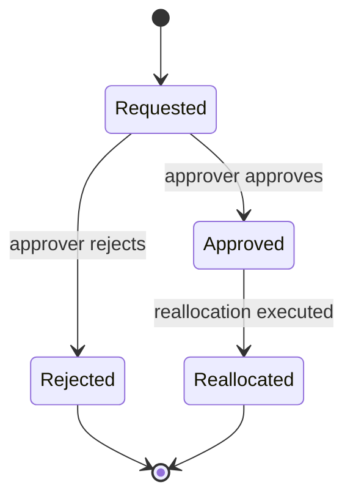
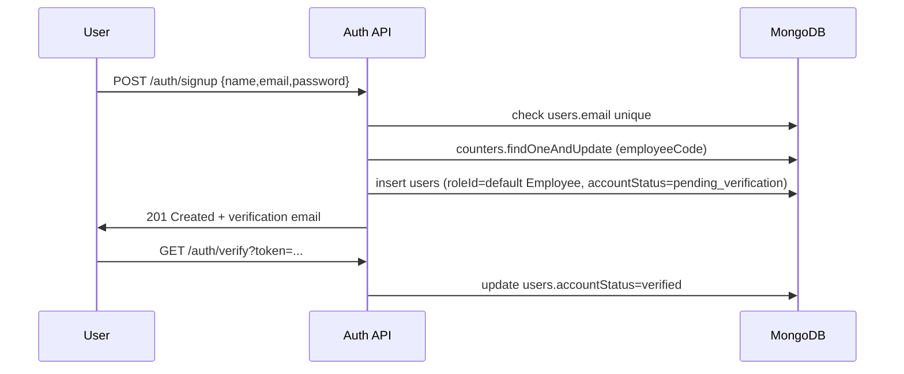
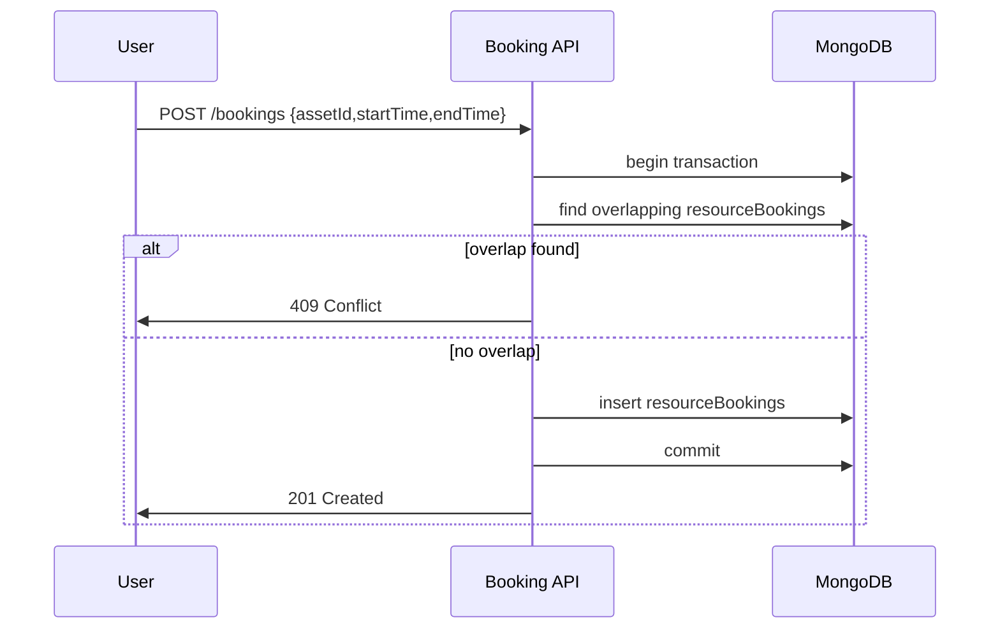

# AssetFlow — Enterprise Asset & Resource Management System
## MongoDB Database Architecture & Software Design Document

**Prepared as a production-grade architecture specification** (hackathon-feasible, enterprise-pattern)

---

## Table of Contents

1. System Overview
2. Business Domain Model
3. Collection List & Justification
4. Database Architecture & Design Philosophy
5. ER Diagram
6. Collection-by-Collection Design (JSON structures, fields, indexes, validation)
7. Mongoose Schema Recommendations
8. Relationship Diagrams
9. Index Strategy
10. Validation Rules Summary
11. Aggregation Pipelines (Dashboard & Reports)
12. Transaction Workflows
13. State Diagrams
14. REST API Mapping
15. RBAC Design
16. Security Considerations
17. Performance Optimization
18. Scaling Strategy
19. Future Extensibility
20. Final Architecture Recommendations

---

## 1. System Overview

AssetFlow is a multi-tenant-ready (single-tenant per deployment) **Enterprise Asset & Resource Management ERP module**. It is deliberately scoped to exclude finance, procurement, and inventory valuation — its job is to be the **system of record for physical/digital assets, who holds them, where they are, and what state they are in**, plus the workflows (allocation, transfer, booking, maintenance, audit) that change that state.

Design principles driving every decision below:

- **Document-oriented modeling, not relational-in-disguise.** Data that is read together is stored together (embedding); data that grows unboundedly, is updated independently, or is shared across many parents is referenced (normalized).
- **Immutable history.** Nothing that represents "what happened" is ever overwritten — allocations, transfers, maintenance, audits, and lifecycle transitions are append-only event trails referencing a mutable "current state" pointer on the asset.
- **RBAC as data, not code.** Roles and permissions are documents, not enum switches, so new roles/permissions can be added without a deploy.
- **Idempotent, race-safe workflows.** Overlapping bookings and duplicate active allocations are prevented at the database layer (unique partial indexes / transactions), not just in application logic.
- **Hackathon-feasible.** Every collection is justified by a real screen/workflow in the spec — no speculative generality.

---

## 2. Business Domain Model



**Core entities:** Organization (implicit, single deployment) → Departments → Employees → Assets → Operational events (allocation, transfer, booking, maintenance, audit) → Cross-cutting concerns (notifications, activity logs, attachments, dashboard metrics, settings).

---

## 3. Collection List & Justification

| # | Collection | Justification |
|---|---|---|
| 1 | `users` | Identity, auth, employee directory (merged — see §4.2) |
| 2 | `roles` | Configurable role definitions (RBAC) |
| 3 | `permissions` | Atomic permission catalog, decoupled from roles |
| 4 | `departments` | Hierarchical org structure |
| 5 | `assetCategories` | Category taxonomy + dynamic field schema |
| 6 | `assets` | Asset master record + current state pointer |
| 7 | `assetLifecycleEvents` | Immutable audit trail of every status transition |
| 8 | `assetAllocations` | Allocation workflow + active-allocation constraint |
| 9 | `assetReturns` | Return details, linked 1:1 to a closed allocation |
| 10 | `transferRequests` | Transfer workflow + approval chain |
| 11 | `resourceBookings` | Calendar bookings with overlap prevention |
| 12 | `maintenanceRequests` | Maintenance workflow state machine |
| 13 | `maintenanceComments` | Threaded technician/approver notes (unbounded growth → separated) |
| 14 | `auditCycles` | Audit cycle metadata + assigned auditors |
| 15 | `auditItems` | Per-asset audit verification result |
| 16 | `notifications` | Read/unread notification feed |
| 17 | `activityLogs` | System-wide immutable action trail |
| 18 | `attachments` | Polymorphic file metadata (images/docs) shared by all modules |
| 19 | `dashboardMetrics` | Precomputed/cached KPI snapshots |
| 20 | `settings` | Org-level configuration (single/few documents) |
| 21 | `sessions` | JWT refresh-token & device session tracking *(added)* |
| 22 | `counters` | Atomic sequence generator for Asset Tag / Employee Code *(added)* |
| 23 | `roleAssignments` *(optional, see note)* | Only needed if a user can hold >1 role — otherwise embedded on `users` |

**Why 3 collections beyond the spec's minimum list:**
- **`sessions`** — the spec requires refresh tokens + session tracking + account status. A refresh token is a mutable, frequently-rotated, per-device record; embedding it on `users` would cause hot-document write contention and bloat the user document with data unrelated to identity. Separated for write isolation.
- **`counters`** — Asset Tags and Employee Codes need atomically-incrementing, human-readable sequences (e.g., `AST-2026-000123`). MongoDB has no native auto-increment; the standard pattern is a small counters collection updated via `findOneAndUpdate` with `$inc`, used inside the same transaction that creates the asset/user.
- **`roleAssignments`** — not created by default. `users.roles` is stored as an embedded array of role IDs (most employees have exactly one role, rarely two). This is called out only so the option is documented if the hackathon scope grows to multi-role, multi-department assignments.

---

## 4. Database Architecture & Design Philosophy

### 4.1 Embedding vs. Referencing — decision table

| Data | Decision | Reason |
|---|---|---|
| Employee emergency contact, documents (metadata) | **Embedded** in `users` | Small, bounded, always read with the parent, never queried independently |
| Employee's department | **Referenced** (`departmentId`) | Department is a shared, independently-updated entity |
| Asset dynamic category fields | **Embedded** as a flexible sub-document on `assets` | Schema-per-category, read every time the asset is read, bounded size |
| Asset lifecycle history | **Referenced / separate collection** (`assetLifecycleEvents`) | Unbounded growth over asset lifetime — embedding would breach the 16MB document limit and degrade read performance on the hot `assets` document |
| Allocation history | **Referenced** (`assetAllocations`) | Same unbounded-growth reasoning; also queried independently ("show me all allocations for employee X") |
| Maintenance comments | **Referenced**, separate from `maintenanceRequests` | Comment threads grow unpredictably (technician back-and-forth); keeps the parent request document small and fast to read on list views |
| Attachments (images/docs) | **Referenced**, polymorphic collection | Same file may need to be attached to assets, maintenance requests, or audits without duplication; also large binary refs (S3/GridFS keys) shouldn't inflate every parent read |
| Permissions on a role | **Embedded array of permission codes** on `roles` | Small, bounded (dozens, not thousands), always read together with the role |
| Current asset status | **Embedded field** (`assets.currentStatus`) denormalized from the latest lifecycle event | This is a deliberate **read-optimized denormalization**: 95% of queries need "what's the asset's status right now," not "what's its history." The lifecycle collection remains the source of truth; the embedded field is updated transactionally alongside every new lifecycle event. |

### 4.2 Why `users` merges "auth" and "employee directory"

The spec describes signup/login/roles and a separate "Employee Directory" with HR-style fields. These describe **one entity, one lifecycle** — a person exists once in the organization. Splitting them into `users` + `employees` would require a join on every single authenticated request (every request needs both identity and profile data) and introduces referential-integrity risk (orphaned employee records, duplicate emails). We keep **one `users` collection** with auth fields and directory fields together, and use **projection** (`.select()`) to exclude sensitive auth fields (`passwordHash`, `refreshTokenHash`) from directory-listing responses. This is the standard "fat user document, thin API projection" pattern used by Odoo/ERPNext-style systems.

### 4.3 Document growth management

- **Unbounded children → own collection, referenced by `parentId`**: lifecycle events, allocations, transfers, bookings, maintenance requests/comments, audit items, notifications, activity logs, attachments.
- **Bounded children → embedded**: dynamic category field values, emergency contact, approval-chain steps on a single transfer (max a handful of approvers), booking reminder settings.
- **Time-bucketed collections avoided at hackathon scale** (activity logs/notifications could later be bucketed by month for TTL efficiency — noted in §18).

### 4.4 Transaction boundaries

MongoDB multi-document ACID transactions are used only where **cross-collection invariants must hold atomically**:

1. **Asset allocation**: create `assetAllocations` doc + insert `assetLifecycleEvents` doc + update `assets.currentStatus/currentHolder` — all three or none.
2. **Booking creation**: overlap-check read + `resourceBookings` insert wrapped in a transaction with a **unique partial index** as the final safety net against race conditions.
3. **Maintenance start/end**: `maintenanceRequests` status update + `assetLifecycleEvents` insert + `assets.currentStatus` update.
4. **Audit closure**: bulk update of `auditItems` + bulk `assets.currentStatus` updates for missing/damaged assets + `assetLifecycleEvents` inserts.
5. **Asset/employee code generation**: `counters.findOneAndUpdate($inc)` + parent document insert.

Everything else (reads, single-document updates like editing a profile, notification read-status) does **not** need transactions — this keeps write throughput high, since transactions have overhead and should be reserved for genuine multi-document invariants.

### 4.5 Read vs. write optimization

- **Read-heavy collections** (`assets`, `departments`, `assetCategories`, `roles`): denormalize display fields (e.g., `departmentName` cached alongside `departmentId`) and rely on indexes over joins (`$lookup` is avoided in hot paths).
- **Write-heavy collections** (`activityLogs`, `notifications`): insert-only, no update-heavy patterns except a single `isRead` flip; indexed narrowly to keep write amplification low.
- **Dashboard**: never computed live from raw collections on every page load — precomputed into `dashboardMetrics` via scheduled aggregation jobs (see §11), with an on-demand "recompute" fallback for small orgs.

---

## 5. ER Diagram



---

## 6. Collection-by-Collection Design

For each collection: purpose, relationships, JSON structure, field table, validation, indexes, soft-delete, example document.

> **Global conventions applied to every collection:**
> - `_id`: ObjectId, auto-generated
> - `createdAt`, `updatedAt`: Date, managed by Mongoose timestamps
> - `createdBy`, `updatedBy`: ObjectId ref `users` (audit fields), nullable only for system-generated documents
> - `isDeleted: Boolean` (default `false`) + `deletedAt`, `deletedBy` — **soft delete everywhere** except pure event/log collections which are immutable and never deleted (`assetLifecycleEvents`, `activityLogs`); those instead support **archival** (moved to cold storage), not deletion.
> - Schema validation enforced via **MongoDB JSON Schema `$jsonSchema` validators** at the collection level, in addition to Mongoose-level validation, so integrity holds even for direct DB writes.

### 6.1 `users`

**Purpose:** Single source of truth for identity, authentication, RBAC assignment, and HR-style employee directory.
**Relationships:** belongs to one `departments` (many-to-one); has one `roles` (many-to-one, or array for multi-role); self-referencing `managerId` (many-to-one); one-to-many with `sessions`, `notifications`, `activityLogs`, `assetAllocations` (as employee), `assets` (as current holder).

```json
{
  "_id": "ObjectId",
  "employeeCode": "EMP-2026-000142",
  "name": "Ravi Shah",
  "email": "ravi.shah@company.com",
  "passwordHash": "bcrypt-hash",
  "phone": "+91-9876543210",
  "departmentId": "ObjectId -> departments",
  "roleId": "ObjectId -> roles",
  "designation": "Senior Software Engineer",
  "status": "active",
  "profilePhotoAttachmentId": "ObjectId -> attachments",
  "joinDate": "2023-06-01T00:00:00Z",
  "managerId": "ObjectId -> users",
  "emergencyContact": {
    "name": "Meera Shah",
    "relation": "Spouse",
    "phone": "+91-9998887777"
  },
  "documentAttachmentIds": ["ObjectId -> attachments"],
  "accountStatus": "verified",
  "lastLoginAt": "2026-07-10T09:15:00Z",
  "isDeleted": false,
  "createdBy": "ObjectId -> users",
  "updatedBy": "ObjectId -> users",
  "createdAt": "ISODate",
  "updatedAt": "ISODate"
}
```

| Field | Type | Required | Notes |
|---|---|---|---|
| employeeCode | String | Yes | Unique, generated via `counters` |
| email | String | Yes | Unique, lowercase, regex-validated |
| passwordHash | String | Yes | Never returned in API responses |
| departmentId | ObjectId | Yes | — |
| roleId | ObjectId | Yes | Defaults to "Employee" at signup |
| status | Enum | Yes | `active`, `inactive`, `suspended` |
| accountStatus | Enum | Yes | `pending_verification`, `verified`, `locked` |
| managerId | ObjectId | No | Nullable for top-level roles |
| emergencyContact | Object | No | Embedded |
| designation, profilePhotoAttachmentId, documentAttachmentIds | — | No | Optional |

**Validation rules:** email regex + uniqueness; `roleId` must reference an existing, non-deleted role; signup endpoint always forces `roleId` = default "Employee" role (admin-only endpoint to change it later — enforced in app layer, not schema).

**Indexes:**
```js
{ email: 1 } // unique
{ employeeCode: 1 } // unique
{ departmentId: 1 }
{ roleId: 1 }
{ managerId: 1 }
{ status: 1, isDeleted: 1 }
{ name: "text", email: "text" } // directory search
```

### 6.2 `roles`

**Purpose:** Configurable role catalog — data-driven RBAC, not hardcoded enums.
**Relationships:** many-to-many with `permissions` (embedded codes, resolved against `permissions` collection); one-to-many with `users`.

```json
{
  "_id": "ObjectId",
  "name": "Asset Manager",
  "code": "ASSET_MANAGER",
  "description": "Manages asset lifecycle, allocation, and transfers",
  "permissionCodes": ["ASSET_CREATE", "ASSET_UPDATE", "ALLOCATION_APPROVE", "TRANSFER_APPROVE"],
  "isSystemRole": true,
  "isDeleted": false,
  "createdAt": "ISODate",
  "updatedAt": "ISODate"
}
```
**Indexes:** `{ code: 1 }` unique. **Validation:** `permissionCodes` must be a subset of valid codes in `permissions` (app-layer check on save).

### 6.3 `permissions`

**Purpose:** Atomic permission catalog decoupled from roles, so new permissions can be introduced and assigned to roles without redeploying code.

```json
{
  "_id": "ObjectId",
  "code": "ASSET_CREATE",
  "module": "Asset",
  "description": "Create new asset records",
  "isDeleted": false
}
```
**Indexes:** `{ code: 1 }` unique; `{ module: 1 }`.

### 6.4 `departments`

**Purpose:** Hierarchical org structure with parent/child departments and department heads.
**Relationships:** self-referencing `parentDepartmentId` (many-to-one, tree); one-to-many with `users`, `assets`.

```json
{
  "_id": "ObjectId",
  "name": "Information Technology",
  "code": "IT",
  "parentDepartmentId": null,
  "departmentHeadId": "ObjectId -> users",
  "path": ["ObjectId(root)"],
  "level": 0,
  "isDeleted": false,
  "createdBy": "ObjectId -> users",
  "createdAt": "ISODate"
}
```

`path` (materialized path pattern) stores the ancestor chain as an array of ObjectIds, enabling fast "all descendants of department X" queries via `{ path: departmentId }` without recursive `$graphLookup` on every request. `level` supports breadcrumb rendering.

**Indexes:** `{ parentDepartmentId: 1 }`, `{ path: 1 }`, `{ code: 1 }` unique, `{ departmentHeadId: 1 }`.

### 6.5 `assetCategories`

**Purpose:** Category taxonomy plus a **dynamic field schema** so different categories (Laptops vs. Vehicles vs. Furniture) capture different custom attributes without altering the `assets` schema.

```json
{
  "_id": "ObjectId",
  "name": "Laptop",
  "code": "LAPTOP",
  "parentCategoryId": null,
  "dynamicFieldSchema": [
    { "fieldKey": "ramGb", "label": "RAM (GB)", "type": "number", "required": true },
    { "fieldKey": "processor", "label": "Processor", "type": "string", "required": false }
  ],
  "defaultBookable": false,
  "isDeleted": false
}
```
**Indexes:** `{ code: 1 }` unique; `{ parentCategoryId: 1 }`.

### 6.6 `assets`

**Purpose:** The asset master record. Holds identity, classification, ownership, dynamic fields, and a **denormalized current-state pointer** (status, holder, location) for fast reads. History lives in `assetLifecycleEvents`.
**Relationships:** many-to-one `assetCategories`, `departments` (owner); many-to-one `users` (current holder, nullable); one-to-many `assetLifecycleEvents`, `assetAllocations`, `transferRequests`, `resourceBookings`, `maintenanceRequests`, `attachments`.

```json
{
  "_id": "ObjectId",
  "assetTag": "AST-2026-000531",
  "qrCode": "https://cdn.assetflow.io/qr/AST-2026-000531.png",
  "serialNumber": "SN-88231X",
  "categoryId": "ObjectId -> assetCategories",
  "dynamicFields": { "ramGb": 16, "processor": "Intel i7-13700H" },
  "brand": "Dell",
  "model": "Latitude 5540",
  "purchaseDate": "2025-01-15T00:00:00Z",
  "purchaseCost": 95000,
  "warrantyExpiryDate": "2028-01-15T00:00:00Z",
  "condition": "good",
  "location": { "building": "HQ", "floor": "3", "room": "IT Lab" },
  "imageAttachmentIds": ["ObjectId -> attachments"],
  "documentAttachmentIds": ["ObjectId -> attachments"],
  "isSharedResource": false,
  "isBookable": false,
  "departmentOwnerId": "ObjectId -> departments",
  "currentHolderId": "ObjectId -> users",
  "currentHolderType": "user",
  "currentStatus": "allocated",
  "isDeleted": false,
  "createdBy": "ObjectId -> users",
  "updatedBy": "ObjectId -> users",
  "createdAt": "ISODate",
  "updatedAt": "ISODate"
}
```

| Field | Type | Notes |
|---|---|---|
| assetTag | String | Unique, generated via `counters` |
| currentStatus | Enum | `available, allocated, reserved, under_maintenance, lost, retired, disposed` — **mirrors the latest `assetLifecycleEvents` entry**, updated only inside the same transaction as a new lifecycle event |
| currentHolderId / currentHolderType | ObjectId / Enum(`user`,`department`) | Supports both employee- and department-level holding |
| dynamicFields | Mixed/Object | Validated against `assetCategories.dynamicFieldSchema` at the app layer |
| isSharedResource / isBookable | Boolean | Drives whether the asset appears in the booking calendar |

**Validation:** `currentStatus` transitions restricted to the state machine in §13.1 (enforced in app layer + confirmed by the paired lifecycle event); `assetTag`/`serialNumber` unique.

**Indexes:**
```js
{ assetTag: 1 } // unique
{ serialNumber: 1 } // unique, sparse
{ categoryId: 1 }
{ departmentOwnerId: 1 }
{ currentHolderId: 1 }
{ currentStatus: 1 }
{ isBookable: 1, currentStatus: 1 } // booking calendar queries
{ isDeleted: 1 }
{ brand: "text", model: "text", assetTag: "text" } // search
```

### 6.7 `assetLifecycleEvents`

**Purpose:** **Immutable, append-only** trail of every status transition an asset undergoes — the system of record for "never lose history."
**Relationships:** many-to-one `assets`; many-to-one `users` (actor); loosely references the workflow document that caused the transition (`sourceType`/`sourceId` — polymorphic).

```json
{
  "_id": "ObjectId",
  "assetId": "ObjectId -> assets",
  "fromStatus": "available",
  "toStatus": "allocated",
  "sourceType": "allocation",
  "sourceId": "ObjectId -> assetAllocations",
  "actedBy": "ObjectId -> users",
  "notes": "Allocated to Ravi Shah for onboarding",
  "occurredAt": "ISODate"
}
```
**Never updated or deleted.** **Indexes:** `{ assetId: 1, occurredAt: -1 }` (compound, for asset history timeline); `{ sourceType: 1, sourceId: 1 }`.

### 6.8 `assetAllocations`

**Purpose:** Tracks who/what an asset is allocated to, expected/actual return, and approval workflow. **Enforces "no multiple active allocations per asset."**
**Relationships:** many-to-one `assets`; many-to-one `users` (allocatedTo, approvedBy); optionally many-to-one `departments` (if department-level allocation); one-to-one with `assetReturns` once closed.

```json
{
  "_id": "ObjectId",
  "assetId": "ObjectId -> assets",
  "allocationType": "employee",
  "allocatedToUserId": "ObjectId -> users",
  "allocatedToDepartmentId": null,
  "requestedBy": "ObjectId -> users",
  "approvedBy": "ObjectId -> users",
  "approvalStatus": "approved",
  "expectedReturnDate": "2026-08-01T00:00:00Z",
  "actualReturnDate": null,
  "status": "active",
  "createdAt": "ISODate",
  "updatedAt": "ISODate"
}
```

**Critical constraint — one active allocation per asset:**
```js
db.assetAllocations.createIndex(
  { assetId: 1 },
  { unique: true, partialFilterExpression: { status: "active" } }
)
```
A **partial unique index** on `assetId` filtered to `status: "active"` guarantees, at the database layer, that a second active allocation insert for the same asset fails — even under concurrent requests — closing the race condition that app-layer checks alone cannot fully prevent.

**Indexes:** the partial unique index above; `{ allocatedToUserId: 1, status: 1 }`; `{ expectedReturnDate: 1, status: 1 }` (overdue/upcoming-return dashboard queries).

### 6.9 `assetReturns`

**Purpose:** Captures return condition/notes, closing out an allocation. Kept separate from `assetAllocations` because a return is a distinct event with its own approval/condition-assessment fields, and because reporting ("return condition trends") benefits from querying returns independently of open allocations.
**Relationships:** one-to-one with `assetAllocations` (`allocationId`); many-to-one `assets`, `users` (returnedBy, receivedBy).

```json
{
  "_id": "ObjectId",
  "allocationId": "ObjectId -> assetAllocations",
  "assetId": "ObjectId -> assets",
  "returnedBy": "ObjectId -> users",
  "receivedBy": "ObjectId -> users",
  "returnDate": "ISODate",
  "returnCondition": "good",
  "returnNotes": "Minor scratch on lid, functioning normally",
  "createdAt": "ISODate"
}
```
**Indexes:** `{ allocationId: 1 }` unique; `{ assetId: 1 }`.

### 6.10 `transferRequests`

**Purpose:** Employee-to-employee or department-to-department transfer workflow with a **multi-step approval chain**.
**Relationships:** many-to-one `assets`; many-to-one `users` (fromUser, toUser, requestedBy); embeds the approval chain (bounded — a handful of approvers, always read with the request).

```json
{
  "_id": "ObjectId",
  "assetId": "ObjectId -> assets",
  "fromHolderId": "ObjectId -> users",
  "toHolderId": "ObjectId -> users",
  "requestedBy": "ObjectId -> users",
  "reason": "Department reorganization",
  "status": "approved",
  "approvalChain": [
    { "approverId": "ObjectId -> users", "decision": "approved", "decidedAt": "ISODate", "comment": "OK" }
  ],
  "reallocatedAllocationId": "ObjectId -> assetAllocations",
  "createdAt": "ISODate",
  "updatedAt": "ISODate"
}
```
**Status enum:** `requested, approved, rejected, reallocated`.
**Indexes:** `{ assetId: 1, status: 1 }`; `{ toHolderId: 1 }`; `{ status: 1 }`.

### 6.11 `resourceBookings`

**Purpose:** Calendar-based bookings for shared resources (rooms, vehicles, labs, equipment, projectors) with **hard overlap prevention**.
**Relationships:** many-to-one `assets` (the bookable resource); many-to-one `users` (bookedBy).

```json
{
  "_id": "ObjectId",
  "assetId": "ObjectId -> assets",
  "bookedBy": "ObjectId -> users",
  "purpose": "Client demo",
  "startTime": "2026-07-15T10:00:00Z",
  "endTime": "2026-07-15T11:00:00Z",
  "status": "confirmed",
  "reminderMinutesBefore": 15,
  "cancelledAt": null,
  "cancelledBy": null,
  "rescheduledFromBookingId": null,
  "createdAt": "ISODate",
  "updatedAt": "ISODate"
}
```

**Overlap prevention strategy (two layers):**
1. **App-layer pre-check**: query `{ assetId, status: "confirmed", startTime: { $lt: newEnd }, endTime: { $gt: newStart } }` — must return zero documents before insert.
2. **DB-layer safety net**: wrap the check + insert in a **transaction**; for true concurrency-proofing at scale, maintain a computed `dateBucket` field (e.g., `"2026-07-15"`) and use it with a **unique compound index on `{ assetId, dateBucket, timeSlotKey }`** if bookings are constrained to fixed slot granularity (e.g., 15/30-min slots) — this converts the overlap check into a native uniqueness guarantee. For free-form start/end times (not slot-based), the transaction + re-check pattern is the correct approach since MongoDB has no native range-exclusion constraint.

**Indexes:** `{ assetId: 1, startTime: 1, endTime: 1 }` (compound, primary overlap-query index); `{ bookedBy: 1 }`; `{ status: 1, startTime: 1 }` (upcoming bookings, reminders).

### 6.12 `maintenanceRequests`

**Purpose:** Drives the maintenance state machine and automatically flips the parent asset's status when maintenance starts/ends.
**Relationships:** many-to-one `assets`; many-to-one `users` (reportedBy, approvedBy, technicianId); one-to-many `maintenanceComments`, `attachments`.

```json
{
  "_id": "ObjectId",
  "assetId": "ObjectId -> assets",
  "reportedBy": "ObjectId -> users",
  "priority": "high",
  "status": "in_progress",
  "approvedBy": "ObjectId -> users",
  "technicianId": "ObjectId -> users",
  "vendor": "Dell ProSupport",
  "cost": 4500,
  "resolution": null,
  "photoAttachmentIds": ["ObjectId -> attachments"],
  "createdAt": "ISODate",
  "updatedAt": "ISODate",
  "resolvedAt": null
}
```
**Status enum:** `pending, approved, rejected, technician_assigned, in_progress, resolved`.
**Side effect (transactional):** on transition into `in_progress` → asset `currentStatus = under_maintenance`; on transition into `resolved` → asset `currentStatus` reverts to `available` (or prior operational status), each paired with an `assetLifecycleEvents` insert.

**Indexes:** `{ assetId: 1, status: 1 }`; `{ status: 1, priority: 1 }`; `{ technicianId: 1, status: 1 }`.

### 6.13 `maintenanceComments`

**Purpose:** Threaded notes between reporters, approvers, and technicians. Separated from the parent request because comment volume is unbounded and unrelated to the request's own field-update frequency.
**Relationships:** many-to-one `maintenanceRequests`; many-to-one `users`.

```json
{
  "_id": "ObjectId",
  "maintenanceRequestId": "ObjectId -> maintenanceRequests",
  "authorId": "ObjectId -> users",
  "comment": "Replacement part ordered, ETA 3 days",
  "createdAt": "ISODate"
}
```
**Indexes:** `{ maintenanceRequestId: 1, createdAt: 1 }`.

### 6.14 `auditCycles`

**Purpose:** A periodic audit exercise (e.g., "Q3 2026 IT Asset Audit") with assigned auditors and overall status.
**Relationships:** many-to-many `users` (assigned auditors, embedded array of IDs — bounded); one-to-many `auditItems`.

```json
{
  "_id": "ObjectId",
  "name": "Q3 2026 IT Asset Audit",
  "departmentScope": ["ObjectId -> departments"],
  "assignedAuditorIds": ["ObjectId -> users"],
  "startDate": "ISODate",
  "endDate": "ISODate",
  "status": "verification",
  "reportAttachmentId": "ObjectId -> attachments",
  "createdBy": "ObjectId -> users",
  "createdAt": "ISODate",
  "closedAt": null
}
```
**Status enum:** `planned, assigned, verification, report_generated, closed`.
**Indexes:** `{ status: 1 }`; `{ assignedAuditorIds: 1 }`.

### 6.15 `auditItems`

**Purpose:** Per-asset verification result within an audit cycle — separated from `auditCycles` because an audit can cover thousands of assets (unbounded array avoided).
**Relationships:** many-to-one `auditCycles`, `assets`, `users` (verifiedBy).

```json
{
  "_id": "ObjectId",
  "auditCycleId": "ObjectId -> auditCycles",
  "assetId": "ObjectId -> assets",
  "expectedLocation": { "building": "HQ", "floor": "3", "room": "IT Lab" },
  "verificationResult": "damaged",
  "discrepancyNotes": "Screen crack found",
  "verifiedBy": "ObjectId -> users",
  "verifiedAt": "ISODate",
  "photoAttachmentIds": ["ObjectId -> attachments"]
}
```
**verificationResult enum:** `verified, missing, damaged`.
**Closure side-effect (transactional):** closing the parent `auditCycle` bulk-updates `assets.currentStatus` for every item marked `missing` → `lost`, and `damaged` → routes into a new `maintenanceRequests` document; each change paired with an `assetLifecycleEvents` insert.

**Indexes:** `{ auditCycleId: 1, verificationResult: 1 }`; `{ assetId: 1 }`.

### 6.16 `notifications`

**Purpose:** Per-user notification feed with read/unread state.
**Relationships:** many-to-one `users` (recipient); polymorphic reference to the triggering entity.

```json
{
  "_id": "ObjectId",
  "recipientId": "ObjectId -> users",
  "type": "asset_assigned",
  "title": "New asset assigned",
  "message": "Dell Latitude 5540 (AST-2026-000531) has been assigned to you",
  "relatedEntityType": "assetAllocation",
  "relatedEntityId": "ObjectId",
  "isRead": false,
  "readAt": null,
  "createdAt": "ISODate"
}
```
**Type enum:** `asset_assigned, asset_returned, transfer_approved, booking_reminder, booking_cancelled, maintenance_approved, maintenance_rejected, audit_assigned, audit_discrepancy, overdue_return`.
**Indexes:** `{ recipientId: 1, isRead: 1, createdAt: -1 }` (compound — primary feed query); optional TTL index on `createdAt` for auto-expiring old read notifications after N months (see §18).

### 6.17 `activityLogs`

**Purpose:** Immutable, system-wide log of every significant action for compliance/traceability.
**Relationships:** many-to-one `users` (actor); polymorphic reference to the affected entity.

```json
{
  "_id": "ObjectId",
  "userId": "ObjectId -> users",
  "action": "UPDATE",
  "entityType": "assets",
  "entityId": "ObjectId",
  "oldData": { "currentStatus": "available" },
  "newData": { "currentStatus": "allocated" },
  "ipAddress": "10.0.4.22",
  "device": "Windows 11 / Chrome 126",
  "browser": "Chrome 126",
  "timestamp": "ISODate"
}
```
**Never updated/deleted** — archived, not deleted, per §4. **Indexes:** `{ userId: 1, timestamp: -1 }`; `{ entityType: 1, entityId: 1, timestamp: -1 }`.

### 6.18 `attachments`

**Purpose:** Polymorphic file metadata store (actual bytes in S3/GridFS/blob storage; this collection stores metadata + a pointer) shared across users, assets, maintenance, audits.
**Relationships:** polymorphic — `ownerType`/`ownerId` pattern.

```json
{
  "_id": "ObjectId",
  "ownerType": "asset",
  "ownerId": "ObjectId -> assets",
  "fileName": "invoice_dell_latitude.pdf",
  "fileType": "application/pdf",
  "fileSizeBytes": 245678,
  "storageKey": "s3://assetflow-prod/assets/AST-2026-000531/invoice.pdf",
  "category": "document",
  "uploadedBy": "ObjectId -> users",
  "isDeleted": false,
  "createdAt": "ISODate"
}
```
**Indexes:** `{ ownerType: 1, ownerId: 1 }` (compound, primary lookup pattern).

### 6.19 `dashboardMetrics`

**Purpose:** Precomputed KPI snapshots so the dashboard never runs heavy aggregations synchronously on page load.
**Relationships:** none — standalone cache, optionally scoped per department.

```json
{
  "_id": "ObjectId",
  "scope": "organization",
  "scopeId": null,
  "metricDate": "2026-07-12",
  "metrics": {
    "availableAssets": 412,
    "allocatedAssets": 298,
    "activeBookings": 17,
    "pendingTransfers": 5,
    "upcomingReturns": 9,
    "overdueReturns": 3,
    "maintenanceToday": 2,
    "assetUtilizationPct": 72.3,
    "idleAssets": 34
  },
  "computedAt": "ISODate"
}
```
**Indexes:** `{ scope: 1, scopeId: 1, metricDate: -1 }` unique-ish (one snapshot per scope per day).

### 6.20 `settings`

**Purpose:** Org-level configuration (few documents — one per config namespace).

```json
{
  "_id": "ObjectId",
  "key": "notification_preferences",
  "value": { "overdueReturnReminderDays": 3, "bookingReminderMinutes": 15 },
  "updatedBy": "ObjectId -> users",
  "updatedAt": "ISODate"
}
```
**Indexes:** `{ key: 1 }` unique.

### 6.21 `sessions`

**Purpose:** JWT refresh-token and device/session tracking, isolated from `users` for write-hotpath separation (see §3).

```json
{
  "_id": "ObjectId",
  "userId": "ObjectId -> users",
  "refreshTokenHash": "hash",
  "device": "iPhone 15 / Safari",
  "ipAddress": "203.0.113.5",
  "issuedAt": "ISODate",
  "expiresAt": "ISODate",
  "revokedAt": null
}
```
**Indexes:** `{ userId: 1, revokedAt: 1 }`; TTL index on `expiresAt` to auto-purge expired sessions.

### 6.22 `counters`

**Purpose:** Atomic sequence generator backing human-readable codes (`assetTag`, `employeeCode`).

```json
{ "_id": "assetTag_2026", "seq": 531 }
```
Incremented via `db.counters.findOneAndUpdate({_id: "assetTag_2026"}, {$inc: {seq: 1}}, {upsert: true, returnDocument: "after"})` inside the creating transaction.

---

## 7. Mongoose Schema Recommendations

Representative pattern (applied uniformly across collections):

```javascript
const mongoose = require('mongoose');
const { Schema } = mongoose;

const AssetSchema = new Schema({
  assetTag: { type: String, required: true, unique: true, index: true },
  qrCode: { type: String },
  serialNumber: { type: String, unique: true, sparse: true },
  categoryId: { type: Schema.Types.ObjectId, ref: 'AssetCategory', required: true, index: true },
  dynamicFields: { type: Schema.Types.Mixed, default: {} },
  brand: String,
  model: String,
  purchaseDate: Date,
  purchaseCost: { type: Number, min: 0 },
  warrantyExpiryDate: Date,
  condition: { type: String, enum: ['new', 'good', 'fair', 'poor', 'damaged'] },
  location: {
    building: String, floor: String, room: String
  },
  imageAttachmentIds: [{ type: Schema.Types.ObjectId, ref: 'Attachment' }],
  documentAttachmentIds: [{ type: Schema.Types.ObjectId, ref: 'Attachment' }],
  isSharedResource: { type: Boolean, default: false },
  isBookable: { type: Boolean, default: false },
  departmentOwnerId: { type: Schema.Types.ObjectId, ref: 'Department', required: true, index: true },
  currentHolderId: { type: Schema.Types.ObjectId, refPath: 'currentHolderType' },
  currentHolderType: { type: String, enum: ['User', 'Department'] },
  currentStatus: {
    type: String,
    enum: ['available', 'allocated', 'reserved', 'under_maintenance', 'lost', 'retired', 'disposed'],
    default: 'available',
    index: true
  },
  isDeleted: { type: Boolean, default: false },
  createdBy: { type: Schema.Types.ObjectId, ref: 'User' },
  updatedBy: { type: Schema.Types.ObjectId, ref: 'User' }
}, { timestamps: true });

AssetSchema.index({ brand: 'text', model: 'text', assetTag: 'text' });
AssetSchema.index({ isBookable: 1, currentStatus: 1 });

module.exports = mongoose.model('Asset', AssetSchema);
```

Apply the same discipline to every other collection: explicit `enum` for status fields, `ref` for every foreign key, `timestamps: true` instead of manual `createdAt`, and collection-level `$jsonSchema` validators mirrored from the Mongoose schema for defense-in-depth against non-Mongoose writes (scripts, migrations).

---

## 8. Relationship Diagrams

**Cardinalities, summarized:**

- **One-to-One**: `assetAllocations` ↔ `assetReturns` (a closed allocation has exactly one return record).
- **One-to-Many**: `departments` → `users`; `assetCategories` → `assets`; `assets` → `assetLifecycleEvents`; `maintenanceRequests` → `maintenanceComments`; `auditCycles` → `auditItems`; `users` → `notifications`; `users` → `activityLogs`.
- **Many-to-One**: `users` → `departments` (department); `users` → `roles`; `assets` → `departments` (owner); `assets` → `users` (current holder).
- **Many-to-Many**: `roles` ↔ `permissions` (via embedded `permissionCodes` resolved against `permissions.code`); `auditCycles` ↔ `users` (assigned auditors, embedded array); `departments` ↔ `departments` (self-referential tree, one-to-many per level but many-to-many in the "all ancestors/descendants" sense via `path`).



---

## 9. Index Strategy

**Guiding rule:** index every field used in a `WHERE`-equivalent (`find`/`match`) filter on a hot path, every foreign key used for population, and every sort field used on a list view — but avoid over-indexing collections with high write volume (`activityLogs`, `assetLifecycleEvents`) beyond what their actual query patterns require, since each additional index adds write overhead.

| Collection | Key indexes |
|---|---|
| users | `email`(unique), `employeeCode`(unique), `departmentId`, `roleId`, text(`name`,`email`) |
| assets | `assetTag`(unique), `serialNumber`(unique,sparse), `categoryId`, `currentStatus`, `{isBookable,currentStatus}`, text search |
| assetAllocations | `{assetId}`(unique, partial: status=active), `{allocatedToUserId,status}`, `{expectedReturnDate,status}` |
| resourceBookings | `{assetId,startTime,endTime}`, `{status,startTime}` |
| assetLifecycleEvents | `{assetId,occurredAt:-1}`, `{sourceType,sourceId}` |
| maintenanceRequests | `{assetId,status}`, `{status,priority}`, `{technicianId,status}` |
| auditItems | `{auditCycleId,verificationResult}`, `{assetId}` |
| notifications | `{recipientId,isRead,createdAt:-1}`, TTL on `createdAt` (optional) |
| activityLogs | `{userId,timestamp:-1}`, `{entityType,entityId,timestamp:-1}` |
| departments | `{parentDepartmentId}`, `{path}`, `{code}`(unique) |
| sessions | `{userId,revokedAt}`, TTL on `expiresAt` |

**Compound index ordering rule applied throughout:** equality fields first, then range/sort fields last (e.g., `{status: 1, priority: 1}` — both equality; `{assetId: 1, occurredAt: -1}` — equality then sort).

---

## 10. Validation Rules Summary

- **Schema-level** (Mongoose + mirrored `$jsonSchema`): required fields, enums for every status field, string length caps, numeric minimums (`purchaseCost >= 0`).
- **Uniqueness**: `users.email`, `users.employeeCode`, `assets.assetTag`, `assets.serialNumber` (sparse), `roles.code`, `permissions.code`, `departments.code`, `settings.key`.
- **Referential validity** (app-layer, since MongoDB has no native FK constraints): every `ref` field checked to exist and be non-deleted before save, via a shared `validateReference()` middleware.
- **Business-rule constraints enforced via partial unique indexes**: one active allocation per asset (§6.8); optionally slot-based booking uniqueness (§6.11).
- **State-machine constraints** (app-layer guard functions, one per workflow — see §13): reject any status update that isn't a legal transition from the current status.
- **Dynamic field validation**: `assets.dynamicFields` validated at write time against the owning `assetCategories.dynamicFieldSchema` (required-ness, type-checking) — this keeps the flexible schema safe without a rigid document shape.

---

## 11. Aggregation Pipelines (Dashboard & Reports)

**Example — Available vs. Allocated KPI (feeds `dashboardMetrics`):**
```javascript
db.assets.aggregate([
  { $match: { isDeleted: false } },
  { $group: { _id: "$currentStatus", count: { $sum: 1 } } }
]);
```

**Example — Overdue returns:**
```javascript
db.assetAllocations.aggregate([
  { $match: { status: "active", expectedReturnDate: { $lt: new Date() } } },
  { $lookup: { from: "assets", localField: "assetId", foreignField: "_id", as: "asset" } },
  { $unwind: "$asset" },
  { $project: { assetTag: "$asset.assetTag", allocatedToUserId: 1, expectedReturnDate: 1 } }
]);
```

**Example — Most-used / idle assets (utilization report):**
```javascript
db.assetAllocations.aggregate([
  { $match: { createdAt: { $gte: startOfPeriod } } },
  { $group: { _id: "$assetId", allocationCount: { $sum: 1 }, totalDaysUsed: { $sum: "$durationDays" } } },
  { $sort: { allocationCount: -1 } },
  { $limit: 20 }
]);
```

**Example — Booking heatmap (bookings per day-of-week/hour):**
```javascript
db.resourceBookings.aggregate([
  { $match: { status: "confirmed" } },
  { $project: { dayOfWeek: { $dayOfWeek: "$startTime" }, hour: { $hour: "$startTime" } } },
  { $group: { _id: { day: "$dayOfWeek", hour: "$hour" }, count: { $sum: 1 } } }
]);
```

**Caching strategy:** a scheduled job (cron / worker queue) runs the above pipelines every N minutes (or nightly for heavier reports) and writes results into `dashboardMetrics`; the dashboard API reads that cache. An on-demand "force refresh" endpoint re-runs the pipeline synchronously for small orgs where staleness matters more than load. This avoids re-aggregating raw collections on every dashboard page view — the single biggest performance risk in ERP-style dashboards.

---

## 12. Transaction Workflows

Represented as the sequence of writes inside a single `session.withTransaction()` block:

1. **Allocate asset**: read asset (`currentStatus == available`) → insert `assetAllocations` → insert `assetLifecycleEvents` → update `assets.currentStatus/currentHolderId` → commit. Abort if the partial unique index rejects a concurrent second active allocation.
2. **Return asset**: update `assetAllocations.status = closed, actualReturnDate` → insert `assetReturns` → insert `assetLifecycleEvents` → update `assets.currentStatus = available, currentHolderId = null` → commit.
3. **Approve transfer → reallocate**: update `transferRequests.status = reallocated` → close old `assetAllocations` → open new `assetAllocations` → insert two `assetLifecycleEvents` (return + reallocate) → update `assets.currentHolderId` → commit.
4. **Confirm booking**: re-check overlap inside the transaction → insert `resourceBookings` → commit (aborts and returns a 409 if overlap detected between the check and commit).
5. **Start maintenance**: update `maintenanceRequests.status = in_progress` → insert `assetLifecycleEvents` → update `assets.currentStatus = under_maintenance` → commit.
6. **Close audit cycle**: bulk update `auditItems` (finalize) → for each `missing`/`damaged` item: update `assets.currentStatus` + insert `assetLifecycleEvents` (+ auto-create `maintenanceRequests` for `damaged`) → update `auditCycles.status = closed` → commit.

---

## 13. State Diagrams

### 13.1 Asset Lifecycle


### 13.2 Maintenance Workflow


### 13.3 Audit Cycle


### 13.4 Transfer Request


### 13.5 Employee Signup (sequence)


### 13.6 Resource Booking (sequence)


*(Dashboard generation and notification-flow sequence diagrams follow the same request → aggregation-or-cache-read → response / event → notification-insert → push pattern described in §11 and §6.16.)*

---

## 14. REST API Mapping

| Resource | Endpoints |
|---|---|
| Auth | `POST /auth/signup`, `POST /auth/login`, `POST /auth/refresh`, `POST /auth/logout`, `POST /auth/reset-password` |
| Users | `GET/POST /users`, `GET/PUT/DELETE /users/:id`, `PUT /users/:id/role` (admin only) |
| Departments | `GET/POST /departments`, `PUT/DELETE /departments/:id`, `GET /departments/:id/tree` |
| Asset Categories | `GET/POST /categories`, `PUT/DELETE /categories/:id` |
| Assets | `GET/POST /assets`, `GET/PUT/DELETE /assets/:id`, `GET /assets/:id/history`, `GET /assets/:id/qrcode` |
| Allocations | `POST /allocations`, `PUT /allocations/:id/approve`, `POST /allocations/:id/return` |
| Transfers | `POST /transfers`, `PUT /transfers/:id/approve`, `PUT /transfers/:id/reject` |
| Bookings | `GET/POST /bookings`, `PUT /bookings/:id/cancel`, `PUT /bookings/:id/reschedule`, `GET /bookings/calendar` |
| Maintenance | `POST /maintenance`, `PUT /maintenance/:id/approve`, `PUT /maintenance/:id/assign`, `PUT /maintenance/:id/resolve`, `POST /maintenance/:id/comments` |
| Audits | `POST /audits`, `PUT /audits/:id/close`, `POST /audits/:id/items`, `PUT /audit-items/:id/verify` |
| Notifications | `GET /notifications`, `PUT /notifications/:id/read` |
| Dashboard | `GET /dashboard/metrics`, `POST /dashboard/refresh` |
| Reports | `GET /reports/utilization`, `GET /reports/department-allocation`, `GET /reports/idle-assets`, `GET /reports/export?format=csv|pdf|xlsx` |
| Activity Logs | `GET /activity-logs` (admin/auditor only) |

---

## 15. RBAC Design

- **Roles** (`roles` collection) hold an embedded list of **permission codes**; **permissions** (`permissions` collection) are the atomic, addressable catalog.
- Default seeded roles: `Admin`, `Asset Manager`, `Department Head`, `Employee`, `Auditor` — but the catalog is **not hardcoded**: an Admin can create a new role and attach any subset of permission codes through the UI, with zero code changes.
- Middleware pattern: every authenticated request resolves `req.user.roleId` → role document → `permissionCodes` set; route guards declare a required permission code (e.g., `requirePermission('ASSET_CREATE')`) rather than checking role names directly — this is what makes permissions configurable rather than hardcoded, per the spec's explicit requirement.
- **Department Head** and **Auditor** roles are additionally scoped: their effective permissions are the same catalog, but data-access is further filtered by `departmentId` (Department Head) or by `auditCycles.assignedAuditorIds` (Auditor) at the query layer — role defines *what actions*, scoping middleware defines *on what data*.

---

## 16. Security Considerations

- Passwords stored as `bcrypt`/`argon2` hashes only; never logged, never in `activityLogs.oldData/newData`.
- JWT **access tokens short-lived** (e.g., 15 min); **refresh tokens** stored hashed in `sessions`, rotated on use, revocable per-device (supports "log out all devices").
- Field-level projection excludes `passwordHash`/`refreshTokenHash` from every API response by default.
- All file uploads (`attachments`) stored in object storage with signed, time-limited URLs — never public buckets.
- `activityLogs` capture IP/device/browser for every mutating action, supporting incident investigation.
- Rate limiting on `/auth/*` endpoints; account lockout after repeated failed logins (`users.accountStatus = locked`).
- MongoDB-level: enable **role-based DB users** at the driver-connection level in addition to app-level RBAC (defense in depth); enable **encryption at rest** and **TLS in transit** on the Atlas/self-hosted cluster.
- Input validation via `$jsonSchema` validators guards against malformed writes even if application code has a bug or a script bypasses the ORM.

---

## 17. Performance Optimization

- Dashboard reads from precomputed `dashboardMetrics`, not live aggregation (§11).
- Denormalized `currentStatus`/`currentHolderId` on `assets` avoids a `$lookup` into `assetLifecycleEvents` for the single most common query ("what's this asset's status").
- Compound indexes ordered equality-then-range/sort throughout (§9).
- Text indexes for search on `users` and `assets` avoid full collection scans on directory/asset search.
- Pagination (`cursor`-based on `_id`/`createdAt`) enforced on all list endpoints (`activityLogs`, `notifications`, `assetLifecycleEvents`) to avoid unbounded result sets.
- Read preference `secondaryPreferred` for reporting/dashboard queries once a replica set is in place, isolating heavy analytical reads from the primary write path.

---

## 18. Scaling Strategy

- **Vertical first**: for a hackathon/early-stage deployment, a single replica set (3 nodes for HA) is sufficient.
- **Horizontal (future sharding)**: the natural shard key candidates are `departmentOwnerId` (for `assets`) and a hashed `_id` for high-volume append-only collections (`activityLogs`, `assetLifecycleEvents`, `notifications`) — hashed sharding avoids monotonic-key hotspots on insert-heavy collections.
- **Time-bucketing** for `activityLogs`/`notifications` at larger scale: monthly collections or a **TTL index** to auto-expire notifications/logs beyond a retention window (with prior archival to cold storage/S3 for compliance).
- **Read replicas** absorb reporting/dashboard load, keeping the primary focused on transactional writes.
- **Caching layer** (Redis) in front of `dashboardMetrics` and `roles`/`permissions` (rarely-changing, frequently-read) reduces DB round-trips further as load grows.

---

## 19. Future Extensibility

- **`assetCategories.dynamicFieldSchema`** already supports adding new asset types without schema migration.
- **`roles`/`permissions`** already supports new roles without a deploy.
- Clean seams exist to later add (out of current scope but non-breaking to introduce): procurement/purchase-order linkage (`assets.purchaseOrderId` pointing to a future `purchaseOrders` collection), multi-organization/tenant support (`organizationId` field added to every collection + compound indexes prefixed with it), barcode/RFID scanning events (reusing the `assetLifecycleEvents.sourceType` polymorphic pattern), and mobile offline-sync (via `updatedAt`-based delta queries already present on every document).

---

## 20. Final Architecture Recommendations

1. Build the **`assets` + `assetLifecycleEvents` + `assetAllocations`** trio first — it's the spine every other module (transfers, bookings, maintenance, audits) hangs off of.
2. Implement the **partial unique index** for active allocations and the **transactional overlap check** for bookings *before* building UI — these are the two invariants most likely to break under concurrent hackathon demo traffic if left to app-layer-only checks.
3. Seed `roles`/`permissions` at deploy time (not hardcoded in route files) from day one, even if the UI to manage them comes later — retrofitting RBAC-as-data after routes are hardcoded to role names is expensive.
4. Stand up `dashboardMetrics` with a simple cron job early; it's cheap to build and prevents a last-minute scramble to optimize a slow live-aggregated dashboard before a demo.
5. Treat `activityLogs` and `assetLifecycleEvents` as write-once, append-only from day one in code review — any PR that updates or deletes from these collections should be rejected, since their entire value is immutability.
6. Keep `attachments` polymorphic and storage-agnostic (`storageKey` abstraction) so swapping local disk → S3 later requires no schema change.

This architecture supports every workflow in the specification, keeps MongoDB idioms (embedding for bounded/co-read data, referencing + transactions for unbounded/cross-entity invariants) rather than forcing a relational shape into documents, and is buildable incrementally within a hackathon timeframe while remaining production-defensible.
